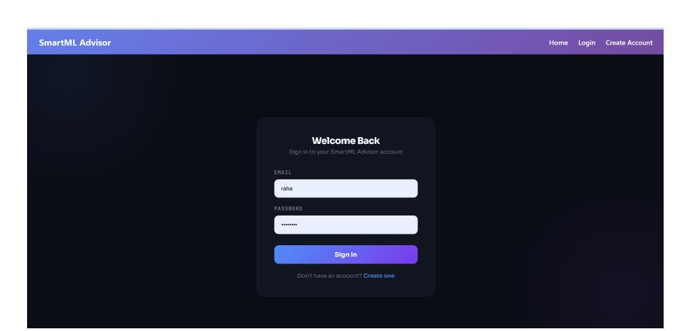
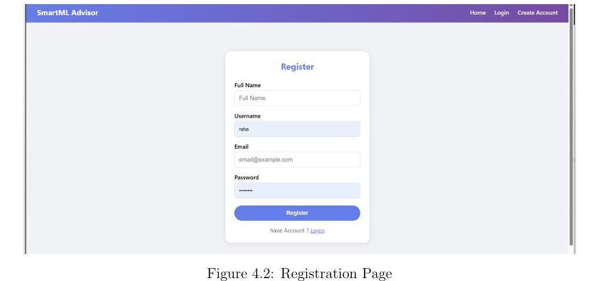
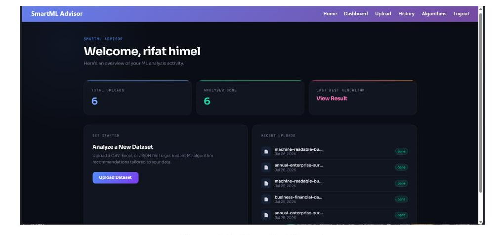
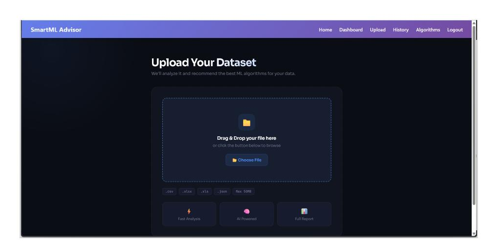
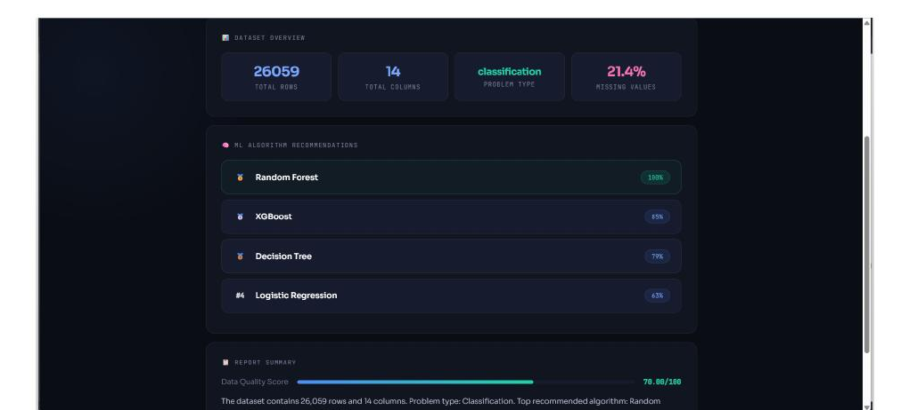
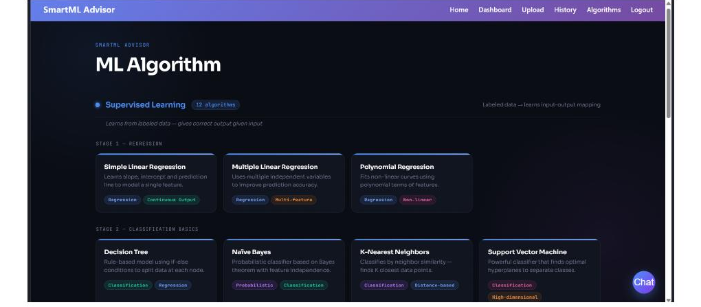

# 🧠 SmartML Advisor

### An Intelligent & Explainable Machine Learning Algorithm Recommendation System

SmartML Advisor is a web-based platform that analyzes uploaded datasets and recommends suitable machine learning algorithms using transparent, rule-based reasoning.

Instead of acting as a black-box AutoML system, SmartML Advisor explains why an algorithm may be suitable for a particular dataset based on characteristics such as problem type, missing values, dataset structure, and class balance.

The project was developed as part of CSE-3210: Software Project Lab (SPL) at the Department of Computer Science and Engineering, Comilla University.

---

## 🎯 Motivation

Choosing an appropriate machine learning algorithm can be challenging, especially for students and beginners.

Algorithm selection is often scattered across notebooks, tutorials, blogs, and peer advice. Beginners may select an algorithm without fully understanding its assumptions or whether it matches the characteristics of their dataset.

SmartML Advisor was built to combine automated dataset analysis with transparent, rule-based guidance in one accessible web application.

> The goal is not only to recommend an algorithm, but also to explain why it may be appropriate.

---

## ❗ Problem Statement

Beginners commonly face several problems when selecting ML algorithms:

- Different algorithms make different assumptions about data.
- Manual trial-and-error becomes inefficient as the number of candidate algorithms increases.
- Full AutoML systems can be computationally expensive and difficult to interpret.
- Important characteristics such as missing values, class imbalance, and problem type may be overlooked.
- Recommendations are often presented without understandable reasoning.

SmartML Advisor addresses these issues through a secure, traceable, database-driven recommendation system that profiles datasets and provides human-readable reasons for its recommendations.

---

## 💡 Core Idea

The basic workflow is simple:

Upload Dataset
      ↓
Dataset Profiling
      ↓
Problem-Type Analysis
      ↓
Rule-Based Scoring
      ↓
Algorithm Ranking
      ↓
Recommendation + Explanation
Rather than automatically training every possible model, SmartML Advisor evaluates relevant characteristics of the dataset and applies predefined recommendation rules.

This makes the recommendation process fast, transparent, and educational.

---

# ✨ Key Features

## 📂 CSV & Excel Dataset Upload

Registered users can securely upload datasets for analysis.

The system supports:

- CSV files
- Excel files

Uploaded files and their associated analyses are linked to the authenticated user.

---

## 🔍 Automated Dataset Profiling

SmartML Advisor automatically analyzes important dataset characteristics, including:

- Number of rows
- Number of columns
- Column data types
- Missing values
- Duplicate records
- Class balance
- Dataset characteristics relevant to algorithm selection

For responsiveness, large datasets are sampled up to 50,000 rows during profiling.

---

## 🧠 Problem-Type Analysis

The recommendation workflow supports three major machine learning problem types:

- Classification
- Regression
- Clustering

Problem-type information is combined with the dataset profile when evaluating suitable algorithms.

---

## 🤖 Rule-Based Recommendation Engine

Candidate ML algorithms are evaluated using predefined scoring rules.

The engine:

1. Retrieves candidate algorithms.
2. Examines the dataset profile.
3. Applies relevant scoring rules.
4. Rewards or penalizes algorithms based on dataset characteristics.
5. Stores the reasons behind those decisions.
6. Ranks the algorithms.
7. Presents the results to the user.

---

## 💡 Explainable Recommendations

Explainability is one of the central ideas behind SmartML Advisor.

Instead of simply displaying:

> Random Forest

the system attempts to answer:

> Why is Random Forest suitable for this dataset?
> Recommendation reasons are stored separately, making the recommendation process more traceable and understandable.

The aim is to move from:

> "Use this algorithm."

to:

> "Use this algorithm, and understand why."

---

## 📚 ML Algorithm Reference Library

SmartML Advisor also contains an independent algorithm reference library.

Users can explore ML algorithms without uploading a dataset.

The library includes categories such as:

- Classification
- Regression
- Clustering
- Dimensionality Reduction
- Association

This makes the application useful as both a recommendation system and a learning resource.

---

## 💬 AI Chat Assistant

An auxiliary AI chat assistant is integrated into the application using the Groq API.

Model used:

llama-3.1-8b-instant
The assistant provides an additional way for users to ask machine-learning-related questions.

Importantly, the core recommendation engine itself remains rule-based and does not depend on the LLM.

---

## 🔐 Authentication & Security

SmartML Advisor provides secure multi-user functionality using:

- JWT-based authentication/session tokens
- bcrypt password hashing
- Protected application routes
- User-specific data ownership
- SQLAlchemy ORM database operations

Passwords are verified using bcrypt and are not stored as plain text.

---

## 📜 History, Feedback & Activity Tracking

The system maintains persistent records of:

- Dataset uploads
- Dataset profiles
- Column statistics
- Analysis reports
- Algorithm recommendations
- Recommendation reasons
- User feedback
- Activity logs

This creates a traceable history of the recommendation process.

---

# 📸 Application Preview

## 🔐 Login

The authentication system provides a dedicated login interface for registered users.

---

## 📝 Registration

New users can create an account through the registration interface.

---

## 🏠 User Dashboard

The dashboard acts as the central hub for ML analysis activity.

It provides access to:

- Dataset uploads
- Previous analyses
- Recent uploads
- Recommendation results
- Algorithm library
- History
- AI assistant

---

## 📤 Dataset Upload

Users can upload supported datasets through the dataset analysis interface.

---

## 🧠 Recommendation Results

After profiling a dataset, SmartML Advisor displays information such as:

- Total rows
- Total columns
- Detected problem type
- Missing-value percentage
- Ranked algorithms
- Suitability scores
- Data quality information
- Report summary

An example classification analysis produced rankings including:

| Algorithm | Suitability |
|---|---:|
| Random Forest | 100% |
| XGBoost | 86% |
| Decision Tree | 79% |
| Logistic Regression | 63% |

---

## 📚 Algorithm Reference Library

Users can independently browse ML algorithms and learn about their categories and characteristics.

---

# 🏗️ System Architecture

SmartML Advisor follows a three-tier architecture.

`text
┌──────────────────────────────────────┐
│          PRESENTATION LAYER          │
│                                      │
│ Browser + Jinja2 Templates           │
│ User Portal • Admin Portal • Chat UI │
└──────────────────┬───────────────────┘
                   │
                   ▼
┌──────────────────────────────────────┐
│           APPLICATION LAYER          │
│                                      │
│ FastAPI Routers & Business Logic     │
│ JWT / bcrypt Authentication          │
│ Upload & Profiling                   │
│ Scoring & Recommendation             │
│ Algorithm Library                    │
│ History & Feedback                   │
│ Activity Logging                     │
│ AI Chat Assistant                    │
│ File Handling                        │
└──────────────────┬───────────────────┘
                   │
                   ▼
┌──────────────────────────────────────┐
│              DATA LAYER              │
│                                      │
│ MySQL Database                       │
│ Dataset File Storage                 │
│ External Groq LLM API                │
└──────────────────────────────────────┘

---

# 🛠️ Technology Stack

| Area | Technology |
|---|---|
| Programming Language | Python |
| Backend Framework | FastAPI |
| Database | MySQL |
| ORM | SQLAlchemy |
| Data Processing | pandas |
| Numerical Processing | NumPy |
| Statistical Processing | SciPy |
| ML Ecosystem | scikit-learn |
| Authentication | JWT |
| Password Security | bcrypt |
| AI Assistant | Groq API |
| LLM | llama-3.1-8b-instant |
| Templates | Jinja2 |
| ASGI Server | Uvicorn |

---

# 🗄️ Database Design

SmartML Advisor uses a normalized relational MySQL database containing **12 tables**.

### Identity

- `users`
- `user_sessions`

### Algorithm Reference

- `algorithm_categories`
- `ml_algorithms`

### Upload & Profiling

- `file_uploads`
- `dataset_profiles`
- `column_statistics`

### Recommendation

- `recommendations`
- `recommendation_reasons`
- `analysis_reports`

### Feedback & Auditing

- `user_feedback`
- `activity_logs`

The schema uses:

- Primary keys
- Foreign keys
- Referential constraints
- `ON DELETE CASCADE`
- `SET NULL` where appropriate

The database design follows normalization through:

text
1NF → 2NF → 3NF

### 1NF

Values are stored atomically rather than combining multiple values into a single field.

### 2NF

Non-key attributes depend on the complete primary key.

### 3NF

Reference/category information is separated into appropriate tables rather than being unnecessarily duplicated.

---

# 🔄 Detailed Recommendation Workflow

text
USER
 │
 │ Upload CSV / Excel
 ▼
BROWSER
 │
 │ POST /upload
 ▼
FASTAPI ROUTER
 │
 ├──────────────► Store Upload Information
 │
 ▼
DATA PROFILER
 │
 ├── Infer Data Types
 ├── Count Rows / Columns
 ├── Analyze Missing Values
 ├── Detect Duplicates
 ├── Analyze Class Balance
 └── Generate Dataset Profile
 │
 ▼
ML RECOMMENDER
 │
 ├── Retrieve Candidate Algorithms
 ├── Apply Scoring Rules
 ├── Generate Reasons
 ├── Calculate Suitability
 └── Rank Algorithms
 │
 ▼
MYSQL DATABASE
 │
 ├── Store Dataset Profile
 ├── Store Recommendations
 └── Store Recommendation Reasons
 │
 ▼
RESULT PAGE
 │
 ▼
Ranked Algorithms + Explanations

---

# 📁 Project Structure

text
SmartML-Advisor/
│
├── database/
│   └── Database-related resources
│
├── routers/
│   └── FastAPI route definitions
│
├── services/
│   ├── Dataset profiling
│   ├── Recommendation logic
│   ├── History
│   ├── Feedback
│   └── AI chat functionality
│
├── templates/
│   └── Jinja2 frontend templates
│
├── uploads/
│   └── Uploaded dataset storage
│
├── docs/
│   └── images/
│       ├── slide15_1.png
│       ├── slide15_2.png
│       ├── slide16_1.png
│       ├── slide17_1.png
│       ├── slide17_2.png
│       └── slide18_1.png
│
├── database.py
├── main.py
├── models.py
├── requirements.txt
└── README.md
`

---

# 🧪 Testing & Validation

SmartML Advisor passed:

## ✅ 18 / 18 Functional Test Cases

Testing covered:

- Authentication
- User sessions
- Dataset upload
- Dataset profiling
- Recommendation scoring
- Algorithm ranking
- History
- Feedback
- Groq-powered chat assistant

### Security & Reliability Checks

The project also verifies that:

- JWT-protected routes reject missing or invalid tokens.
- Passwords are verified using bcrypt.
- SQLAlchemy ORM parameterized operations help prevent SQL injection.
- Large datasets are sampled for responsiveness.
- A failed Groq API call does not crash the recommendation workflow.
- Upload ownership is scoped to the authenticated user.

---
# 📊 Results & Evaluation

SmartML Advisor was tested using 9 real-world datasets covering classification, regression, and clustering scenarios.

## Classification

Example datasets:

- weather_data.csv
- students_records.csv

These favored algorithms including:

- Random Forest
- Decision Tree
- XGBoost

---

## Regression

Example datasets:

- Yield_df.csv
- Real_Combine.csv

These favored algorithms including:

- Linear Regression
- Ridge Regression
- Random Forest Regressor

---

## Clustering

Datasets without a clear target included:

- bal2.csv
- car1.csv

These were routed toward clustering algorithms such as:

- K-Means
- DBSCAN

---

## 📈 Example Profiling Result

One test dataset contained:

Rows:              26,059
Columns:           14
Problem Type:      Classification
Missing Values:    21.4%
For this example, Random Forest received a 100% suitability score.

Algorithms less suited to datasets with high levels of missing data, including Logistic Regression and SVM, were penalized by the rule engine, with readable reasons stored by the system.

---

# 🚀 Installation & Setup

## 1. Clone the Repository

git clone https://github.com/abrafi123/SmartML-Advisor.git
Enter the project directory:

cd SmartML-Advisor
---

## 2. Create a Virtual Environment

python -m venv venv
### Windows

venv\Scripts\activate
### Linux / macOS

source venv/bin/activate
---

## 3. Install Dependencies

pip install -r requirements.txt
---

## 4. Configure MySQL

Create the required MySQL database and configure the application's database connection.

The application uses SQLAlchemy to interact with the MySQL relational database.

---

## 5. Configure Required Secrets

Configure sensitive credentials such as:

Database credentials
JWT secret
Groq API key
using an appropriate local/environment configuration.

> ⚠️ Security: Never commit database passwords, JWT secrets, Groq API keys, or other credentials to a public GitHub repository.

---

## 6. Start the Application

uvicorn main:app --reload
The FastAPI application should then start on your local development server.

---

# ⚠️ Current Limitations

SmartML Advisor is currently an academic project and has several known limitations.

### 1. Hand-Crafted Scoring Rules

The recommendation engine currently uses fixed rules rather than a learned meta-model.

### 2. Simple Problem-Type Detection

Problem-type detection currently relies on simple heuristics such as target-column information.

### 3. Dataset Size

Large datasets are sampled to a maximum of 50,000 rows during profiling.

### 4. No Actual Model Benchmarking

Recommended algorithms are not currently trained and evaluated against the uploaded dataset.

The recommendation score is based on dataset meta-features and predefined rules.

### 5. External LLM Dependency

The AI chat assistant depends on the Groq API, introducing external availability and latency considerations.

### 6. Testing

Current testing is primarily manual and scenario-based.

Automated unit, integration, security, and performance testing is not yet comprehensive.

---

# 🔮 Future Work

## 📊 Actual Model Benchmarking

Train top-ranked algorithms on a sample of the user's dataset and report real performance metrics such as:

- Accuracy
- F1 Score
- RMSE

---

## 🧠 Meta-Learning Recommendation

Introduce a trained meta-learning model that can learn from historical results and user feedback to improve future recommendations.

---

## 🧹 Preprocessing Advisor

Generate concrete preprocessing suggestions based on the dataset profile, including:

- Missing-value imputation
- Categorical encoding
- Other preprocessing decisions

---

## ⚡ Large Dataset Processing

Introduce streaming or chunk-based processing to support datasets beyond the current 50,000-row profiling limit.

---

## 🖥️ Administrative Dashboard

Build an administrative dashboard for:

- Algorithm-library management
- Activity monitoring

---
## 🧪 Automated Testing

Expand testing with:

- Unit tests
- Integration tests
- Security tests
- Performance tests

---

# 🌟 Why SmartML Advisor?

Many ML tools focus primarily on:

> "Which model should I use?"

SmartML Advisor focuses on another important question:

> "Why might this model be appropriate for my dataset?"

The project aims to make ML algorithm selection:

### Transparent · Traceable · Explainable · Educational

---

# 👨‍💻 Author

## Abu Bakar Rafi

BSc in Computer Science and Engineering  
Department of Computer Science and Engineering  
Comilla University, Bangladesh

### Areas of Interest

- Artificial Intelligence
- Machine Learning
- Explainable AI
- Data-Driven Systems
- Backend Development
- FinTech
- HealthTech

### 🔗 Connect

GitHub:  
https://github.com/abrafi123

LinkedIn:  
https://www.linkedin.com/in/ab-rafi-838246338

---

# 🎓 Academic Context

Project: SmartML Advisor  
Course: CSE-3210 — Software Project Lab (SPL)  
Department: Computer Science and Engineering  
University: Comilla University  
Supervisor: Md. Zahidur Rahman, Lecturer, Department of CSE

---

# 💭 Final Note

SmartML Advisor started from a simple observation:

> Choosing an ML algorithm is relatively easy. Understanding why it is appropriate is much harder.

The project explores how dataset profiling, relational database design, transparent recommendation rules, and explainable reasoning can work together to help users make more informed machine learning decisions.

---

⭐ If you find SmartML Advisor useful or interesting, consider starring the repository!
